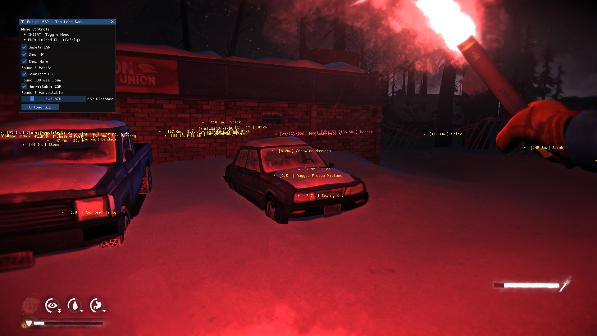

# Fubuki-ESP


**Fubuki-ESP** (Blizzard ESP) is a lightweight internal DLL for **The Long Dark**, designed specifically for game exploration and identifying in-game entities.

## Features
- **BaseAi ESP**: Highlights animals and other AI entities.
  - Health Display
  - Name Display
- **GearItem ESP**: Shows locations of items (tools, food, resources).
- **Harvestable ESP**: Highlights plants and harvestable objects.
- **Customizable Distance**: Adjustable ESP range via the built-in menu.
- **In-Game Menu**: Toggle features on the fly.

## Compatibility
- **Game Version**: The Long Dark [v2.51 Steam Release](https://steamdb.info/patchnotes/21125554/)
- **Platform**: Windows
- **Renderer**: DirectX 11

## Usage
To use this project, you need to inject the compiled `fubuki_tld.dll` (found in the `build/` directory after building) into the game process (`tld.exe`).

### Recommended Injectors:
1.  **AeroInject**: A simple and clean DLL injector.
    - Download: [AeroInject GitHub](https://github.com/phys-winner/AeroInject)
2.  **Cheat Engine**:
    - Download: [Cheat Engine Official](https://www.cheatengine.org/)
    - **Instructions**:
      1. Open Cheat Engine.
      2. Select `tld.exe` from the process list.
      3. Go to `Memory View` -> `Tools` -> `Inject DLL`.
      4. Select `fubuki_tld.dll` and confirm.

### Hotkeys:
- **INSERT**: Toggle Menu
- **END**: Unload DLL

## Building
To build the project from source:
1. Clone the repository with submodules:
   ```bash
   git clone --recursive https://github.com/yourusername/Fubuki-ESP.git
   ```
   *If you already cloned it without `--recursive`, run: `git submodule update --init --recursive`*
2. Open a **Developer Command Prompt for VS**.
3. Run `build.bat`.
4. The resulting `fubuki_tld.dll` will be created in the `build/` directory.

## Future Roadmap
- Performance optimizations (e.g., caching gear item names).
- Enhanced filtering (e.g., skip low-value items like stones).
- Radar ESP.
- Fullbright mode.
- Support for additional item types (carcasses, containers).
- Compatibility with additional graphics APIs (DirectX 9, Vulkan, OpenGL).
- Compatibility with DLC (Wintermute).
- Automatic intro and loading screen skipping.

## Contributors
- **Antigravity** (Lead Developer/AI Assistant)

---
*Disclaimer: This project is for educational and exploration purposes only.*
